# 手順書：基本設計から PR 作成まで

> 誰が・いつ・何をするか。**判断の根拠は `docs/adr/`、用語は `CONTEXT.md`、禁止事項は `CLAUDE.md`。**
> この手順書は「人の動き」の正本。機械の担保（hook / CI）が何を守るかも各工程に併記する。

## 読み方

- **人がやること**と**AI がやること**を分けて書く。上流も下流も**自分の手ではコードを書かない**。
- 各工程に **機械の担保** がある。宣言だけのルールは破られる前提で読むこと。
- AFK＝人が介入しない区間。HITL＝人が判定する関所。

---

## 全体像

**進め方はフェーズ型大バッチ（ADR-0016）。** 縦切りで1本を端まで通すのではなく、各フェーズを**全スライスに対して回し切ってから**次フェーズへ移る。

```
【一度きり】 Step 0 リポジトリ準備 → 工程1 基本設計＋設計凍結ゲート → 工程2 issue 分解＋/board 採番
【上流フェーズ：全スライス】 各 slice で 工程3 /spec PhaseA（grill→仕様表）→【承認：PM／AIアーキ同列・ADR-0017】→ 工程4 /spec PhaseB（翻訳＋golden）→ 工程5 /brief。全 slice 完了まで繰り返す
   └─ 全スライス上流完了 →【CI 構築：下流フェーズ突入の必須前提（ADR-0016）】
【下流フェーズ：全スライス】 各 slice で 工程6 /slice（AFK）。全 slice 実装完了まで繰り返す
【統合フェーズ：全スライス】 各 PR で 工程7〜9b /integrate（PhaseA 再検証 →【工程8 PM GO】→ PhaseB マージ → 工程9b 総合テスト）。CI マージキューが直列マージ＋再検証を自動化
【却下・回帰したら】 工程10 /flywheel ／ 総合テスト赤は /board で回帰スライスを append して fix-forward
【各工程の入口】 /board で現在地を確認（read-only）
```

**フェーズ順・工程順は固定。** 特に「失敗する受け入れテストが main にある」状態を全スライス分作ってから実装フェーズへ移ること（上流フェーズ→下流フェーズ）。逆にすると下流の `/pickup` が指示書「2. 受け入れテスト」を指せない。

**工程3→4 の間には人の承認が入る**（`approved: true`）。ひと続きで走らせると、AI が自分で書いた仕様表を自分で翻訳して自分で PR を出すことになる（ADR-0012）。

**工程7→9 の間にも人の判断が入る**（工程8 の PM GO）。`/integrate` は `/spec` と同型の二フェーズで、Phase A（再検証）で停止して GO を待ち、Phase B（マージ→総合テスト）へ進む（ADR-0014）。**不可逆操作は人の GO の後だけ。**
統合フェーズは全 PR が一斉到着し、マージのたびに残 PR が古くなる（Require branches up to date）。この直列マージ＋再検証は **CI マージキューが担う**（ADR-0016。だから CI が下流フェーズ突入の前提）。

---

## 開発フロー図（誰が・どのコマンドで・どの道具を使うか）

```mermaid
flowchart TD
    subgraph ONCE["🟩 一度きり（キックオフ）"]
        S0["Step 0 リポジトリ準備<br/><b>PM／AIアーキ（同列）</b><br/>―<br/>vendor / ブランチ保護 / hooks 配置"]
        P1["工程1 基本設計<br/><b>PM／AIアーキ（同列・承認も相互可）</b><br/>素の会話 ＋ grill-with-docs<br/>→ docs/design/overview.md"]
        P2["工程2 issue 分解<br/><b>PM／AIアーキ（同列）</b><br/>to-issues<br/>→ docs/slices/README.md"]
        S0 --> P1 --> P2
    end

    subgraph UP["🟩 上流フェーズ（全スライス）"]
        P3["工程3 <b>/spec &lt;slice&gt;</b> Phase A<br/><b>PM／AIアーキ（同列）</b> が叩き、grill に答える<br/>grill-with-docs<br/>→ docs/spec/slice-NN.md"]
        P4["工程4 <b>/spec &lt;slice&gt;</b> Phase B<br/><b>PM／AIアーキ（同列）</b> が再実行<br/>runner＋Playwright＋Context7<br/>→ acceptance/ ＋ golden/"]
        G1{"重量ゲート<br/><b>PM／AIアーキ（同列）</b> が diff を読む"}
        P5["工程5 <b>/brief &lt;slice&gt;</b><br/><b>リーダー</b>＋PM／AIアーキ（同列）<br/>GitHub MCP で issue 起票<br/>→ docs/slices/slice-NN.md"]
        AP{"<b>PM／AIアーキ（同列）</b> が approved: true<br/>に変えるまで停止"}
        P3 --> AP -- "承認" --> P4 --> G1 -- GO --> P5
    end

    subgraph DOWN["🟦 下流フェーズ（全スライス・AFK：人は介入しない）"]
        D1["<b>/pickup</b> — GitHub MCP で issue<br/>指示書は repo から読む"]
        D2["<b>/explore</b> — Explore(Haiku)<br/>Read/Grep/Glob のみ"]
        D3["<b>/implement</b> — runner で起動<br/>/tdd・/diagnose・Context7<br/>緑までループ"]
        D4["<b>/verify</b> — 4判定を機械で○×<br/>（ADR-0018）"]
        D5["<b>/submit</b> — push＋PR(GitHub MCP)<br/>Audit(Opus) が推奨判定<br/>KPI 1行記録"]
        D1 --> D2 --> D3 --> D4
        D4 -- "✗" --> D3
        D4 -- "全て○" --> D5
    end

    subgraph GATE["🟨 統合フェーズ（全スライス・HITL）＝ /integrate（二フェーズ）"]
        H1["工程7 再検証（Phase A）<br/><b>統合役</b> が /integrate<br/>当該スライス＋秘密＋差分 → 停止"]
        H2{"工程8 層境ゲート<br/><b>PM</b>（代理：リーダー1名）<br/>軽量／重量は CI ラベルで決まる"}
        H3["工程9 マージ（Phase B）<br/><b>統合役</b> が /integrate 再実行<br/>gh pr merge（server-side）"]
        H4["工程9b 総合テスト<br/>main で全スイート E2E<br/>（reference-mock＋backend＋frontend）"]
        H5{"総合テスト<br/>緑/赤？"}
        H1 --> H2 -- "GO" --> H3 --> H4 --> H5
    end

    FW["工程10 <b>/flywheel</b><br/><b>Harness-Keeper</b>（AIアーキ）<br/>→ ADR / CONTEXT.md / hook 昇格草案"]
    RG["回帰：分析で2分岐<br/>/board が回帰スライスを append"]

    P2 --> P3
    P5 -. "次スライスへ（全 slice 分）" .-> P3
    P5 ==>|"全スライス上流完了"| CI["🟥 CI 構築（下流突入の必須前提）<br/>受け入れCI＋マージキュー・ADR-0016"]
    CI ==> Human(["👤 実装メンバー<br/>各 slice で /slice"])
    Human --> D1
    D5 -. "次スライスへ（全 slice 分）" .-> D1
    D5 ==>|"全スライス実装完了"| H1
    H1 -. "NG：差し戻し" .-> D3
    H2 -. "NO-GO" .-> FW
    H5 -. "赤：fix-forward" .-> RG
    H5 -- "緑：次PRへ（残あり）" --> H1
    H5 ==>|"全PR統合完了"| Done(["✅ 全スライス main 前進"])
    RG -.->|"既存 E2E が赤"| P5
    RG -.->|"総合スイートに穴"| P3
    FW -.->|"スライス設計の欠陥"| P2
    FW -.->|"ハーネスの欠陥"| S0

    classDef once fill:#DCF0DC,stroke:#2F855A,color:#1a1a1a
    classDef up fill:#DCF0DC,stroke:#2F855A,color:#1a1a1a
    classDef down fill:#D7E9F7,stroke:#2B6CB0,color:#1a1a1a
    classDef gate fill:#FFF3C4,stroke:#B7791F,color:#1a1a1a
    classDef fly fill:#E6E0F8,stroke:#6B46C1,color:#1a1a1a
    classDef human fill:#FFF3C4,stroke:#B7791F,color:#1a1a1a,stroke-width:2px

    class S0,P1,P2 once
    class P3,P4,P5 up
    class AP gate
    class D1,D2,D3,D4,D5 down
    class G1,H1,H2,H3,H4,H5,CI gate
    class FW,RG fly
    class Human,Done human
```



> **凡例**：緑＝上流フェーズ／青＝下流フェーズ（AFK）／黄＝統合フェーズ（HITL）／紫＝Flywheel の書き戻し。
> 細実線＝各フェーズ内の幸福経路、点線＝差し戻し・次スライスへの周回、**太線＝フェーズ移行（全スライス完了が条件）**。
> **人がスラッシュを叩くのは各フェーズの起点だけ**で、フェーズ内は終点の判定まで無人で回る。

---

## 工程 × 担当 × 道具（早見表）

**下流が叩くのは `/slice` の1本だけ。** MCP とサブエージェントは skill が内部で呼ぶので、下流は触らない。

| 工程 | 人（判断） | 叩くコマンド | 使う skill | 使う MCP | サブエージェント | 成果物 |
|---|---|---|---|---|---|---|
| **Step 0** 準備 | PM／AIアーキ（同列） | ―（手作業） | ― | ― | ― | `.claude/` `reference-mock/` ブランチ保護 |
| **工程1** 基本設計 | PM／AIアーキ（同列・承認も相互可） | ―（素の会話） | `grill-with-docs` | ― | ― | `docs/design/overview.md` |
| **工程2** issue 分解 | PM／AIアーキ（同列） | **`/board`** | `to-issues` | ― | ― | `docs/slices/README.md`（採番済みレジストリ） |
| **各工程の入口** 現在地確認 | その工程を始める人 | **`/board`** | ― | GitHub（gh で状態読取） | ― | 表示のみ（read-only） |
| **工程3** 仕様表（Phase A） | **PM／AIアーキ（同列）**（叩く・答える） | **`/spec <slice>`** | 自作 ＋ **`grill-with-docs`** | ― | ― | `docs/spec/slice-NN.md`（`approved: true`） |
| **工程4** 翻訳＋golden（Phase B） | **PM／AIアーキ（同列）**（叩く・ゲート） | **`/spec <slice>`**（再実行） | 自作 | **runner**（起動）＋**Context7**（最新API）＋**GitHub**（PR） | ― | `acceptance/`（**api ＋ ui の二層**・ADR-0018）`acceptance/golden/` |
| **工程5** 指示書＋起票 | **リーダー**（枠・禁止事項）＋**PM／AIアーキ（同列）**（技術の形・受入基準） | **`/brief <slice>`** | 自作 | **GitHub**（issue 起票） | ― | `docs/slices/slice-NN.md` ＋ issue |
| **工程6-1** pickup | 実装メンバー | `/slice <issue>` が内部実行 | 自作 | **GitHub**（issue 取得） | ― | `feature/slice-NN` ブランチ |
| **工程6-2** explore | 〃 | 〃 | 自作 | ― | **Explore**（Haiku・Read/Grep/Glob） | 触ってよい範囲の地図 |
| **工程6-3** implement | 〃 | 〃 | 自作 ＋ **`/tdd`** ＋ **`/diagnose`** | **runner**（起動・ログ）＋**Context7** | ― | 緑になった実装 |
| **工程6-4** verify | 〃 | 〃 | 自作 | **runner**（**frontend 停止**で反転確認・ADR-0018） | ― | 4判定の○×（ADR-0018） |
| **工程6-5** submit | 〃 | 〃 | 自作 | **GitHub**（push・PR） | **Audit**（Opus・Bash なし・`express-review-rules` を参照） | PR ＋ 推奨判定 ＋ KPI 1行 |
| **工程7** 再検証（Phase A） | **統合役** | **`/integrate`** | 自作 | **runner** | ― | 再検証結果 → 停止（GO 待ち） |
| **工程8** 層境ゲート | **PM**（代理：リーダー1名） | ―（GitHub 上で判断） | ― | ― | ― | GO / NO-GO |
| **工程9** マージ（Phase B） | **統合役ただ1人** | **`/integrate`**（再実行） | 自作 | **GitHub**（gh pr merge） | ― | main の前進 |
| **工程9b** 総合テスト | 統合役（自動実行） | **`/integrate`** | 自作 | **runner**（全スイート起動） | ― | 総合 E2E の緑/赤 |
| **回帰**（9b 赤） | 統合役→PM／AIアーキ | **`/board`**（append） | 自作 | ― | ― | 回帰スライス → 工程5 or 工程3 |
| **工程10** 書き戻し | Harness-Keeper（AIアーキ） | **`/flywheel`** | 自作 | ― | ― | ADR／`CONTEXT.md`／hook 昇格草案 |

**道具の正体**

| 種別 | 名前 | 誰が呼ぶか |
|---|---|---|
| MCP | `teamdev-test-runner`（runner） | skill が内部で呼ぶ。**起動するだけ。採点はテストFW** |
| MCP | `Context7` | `/implement` `/spec`。存在しない API のリトライを潰す |
| MCP | `GitHub`（toolsets: issues, pull_requests） | `/pickup` `/submit` `/brief` |
| 既製 skill | `/tdd` `/diagnose`（mattpocock） | `/implement` が内部で呼ぶ |
| 既製 skill | `grill-with-docs` `to-issues`（mattpocock） | 上流が直接使う |
| サブエージェント | `Explore`（Haiku・read-only） | `/explore` が起動。地図だけ返す |
| サブエージェント | `Audit`（Opus・Bash なし） | `/submit` が diff を注入して起動。**推奨判定のみ。マージしない** |
| 監査型 skill | `express-review-rules`（`user-invocable: false`） | Audit が背景知識として読む |
| 自作 skill | `/board`（`disable-model-invocation: true`） | スライスレジストリの採番・一覧・現在地表示。工程2 で採番、各工程の入口で状態確認。番号は不変・append-only（ADR-0013） |
| 自作 skill | `/integrate`（`disable-model-invocation: true`） | 統合役の二フェーズ。Phase A 再検証→停止、Phase B マージ→総合テスト→回帰（ADR-0014） |

> **制御はメインセッションが握る（ハブ＆スポーク）。** サブエージェント同士はバトンを渡さない。
> **並列にしない。** Opus は Audit にのみ温存する。

> **mattpocock/skills の版**：vendor は commit `b8be62f`（2026-07-13 取得。正は各 skill の PROVENANCE.md）。
> スキル名は**オリジナルのまま**（`diagnose`・`to-issues`・`to-prd` 等）。旧記述「v1.1 で `diagnose`→`diagnosing-bugs`、`to-issues`＋`to-plan`→`to-tickets` に改名」は**誤記**のため削除（2026-07-13 訂正）。実名は `to-issues`・`to-prd`（統合・改名なし）。
> matt 版の新スキル **`implement` は自作 `/implement` と名前衝突するため導入しない**（`/handoff` 改名と同型の問題）。
> `grill-with-docs`・`tdd` は `codebase-design`・`domain-modeling` に依存するようになったので、部品抜粋でもこの2つを同梱する。

---

## ロードマップ（いつ何を足すか）

ハーネスは一度に全部作らない。**効果最大・コスト最小から**積む。

| フェーズ | いつ | 足すもの | 完了条件 |
|---|---|---|---|
| **Step 1** | キックオフ週 | CLAUDE.md 剪定／`PreToolUse`（危険コマンド deny-list＋protect-paths）／runner で pass/fail シグナルを確保 | ✅ **完了済み** |
| **Step 2** | 初スプリント中 | `PostToolUse`（lint＋型チェックの feedback）／`Stop` hook／`acceptance/` の read-only 三層化／`/spec` `/brief` の作成／golden 閾値の較正 | 下流が `/slice` を1本完走 |
| **Step 3** | **下流フェーズ突入の前（必須前提・ADR-0016）** | **受け入れテスト CI**（`reference-mock`＋`backend`＋`frontend`＋Playwright）＋**マージキュー／required check**／`irreversible` ラベル自動付与／**依存方向のカスタム lint** | 統合フェーズの一斉到着を直列マージ＋再検証で捌ける |
| **Step 4** | 結合E2E期以降 | Playwright MCP（診断専用）／DBHub（read-only）／doc-gardening | ― |

**Step 3 は下流フェーズ突入の必須前提**（ADR-0016 が ADR-0010 の「初スプリントでは CI を組まない」時期指定を上書き）。
大バッチでは全 feature PR が統合フェーズ末尾に一斉到着し、統合役1人のローカル直列実行では捌けない。
CI（マージキュー）が無いまま下流フェーズに入ると、**「個別に緑な2つの PR がマージ後に赤」を直列に手作業で潰す羽目になり停滞する**。

**Step 3 の3点は Express 化の帰結でもある**（ADR-0011）。フレームワークが構造を強制しないので、
`router → service → repository` の依存方向は**カスタム lint で機械強制しないと必ず崩れる**。

### 初スプリントで通すもの（ADR-0016 でフェーズ型に更新）

**縦切りの「Time-to-first-green（最初の1スライスを端まで通す）」は撤回**（ADR-0016）。代わりに**上流フェーズを回し切る**ことを初期の到達目標に置く。
最初に着手する縦切りは **報告 → 要約 → 確認 → 確定**（参照モックで検証済みの経路で、仕様の書き起こしが最も安定する）だが、これは"端まで通す1本"ではなく**上流フェーズの先頭スライス**として扱う。

---

## 人が自由入力する箇所は3つだけ

**skill ごとのプロンプトサンプルは作らない。** `/slice <issue番号>` も `/spec <slice>` も引数が1つで、自由入力の余地が無いのが設計だから
（「初級者に自由入力させず、決まったスラッシュを順に叩く」）。サンプルを添えると「このコマンドは文章で指示してよい」という
**逆のシグナル**になり、各自がアレンジしてばらつきが戻る。加えてサンプルは真っ先に腐る——**古いルールは欠落より有害**。

人が文章を書くのは次の3箇所だけ。テンプレは **git 管理下**に置く（＝信頼できる入力）。

### ① 工程1 基本設計の起動プロンプト（PM／AIアーキ同列・1回きり）

コマンド化しないと決めた唯一の工程なので、この文言が実質的な仕様になる。

```
reference-mock/ を読んで docs/design/overview.md を起こしてください。
これは設計ではなく answer key の書き起こしです。新しく考えないこと。

出力: 画面一覧／API 一覧（パス・メソッド・ステータスコード）／
      データモデル／Summarizer の境界／スコープ外の明示

参照モックに存在しない挙動を書く場合は「★新規決定」と印を付け、
理由を1行添えてください。それ以外は書き起こしです。
```

**最後の3行が肝。** 書き起こしと本当の設計を混ぜないための機械的な印になる。

### ② `/spec` Phase A で grill に答えるときの心得（PM・毎スライス）

プロンプトではなく心得。1行で足りる。

> **答えられない質問には「未定」と答える。AI に埋めさせない。** 未定が残るまま `approved: true` にしない。

AI が下書きを持ってくると、人は反射的に頷く。`source: PM` を書かせるのも、この心得も、同じ穴を塞ぐためにある。

### ③ スライス指示書「4. 貼り付け用の枠」（リーダー・毎スライス）

**このプロジェクトで人間が書く唯一の本物のプロンプト。** `/implement` がこれを読んで動く。

```
このリポジトリで slice-NN-<slug> を実装します。
- 触ってよいのは指示書「3. ファイル範囲」のファイルのみ。範囲外は変更禁止。
- 「2. 受け入れテスト」を全て緑にするのがゴール。テストは既にあります。
  まず runner で現状の赤を確認し、実装して緑にしてください。
- commit / push / マイグレーションはしないこと。緑になったら停止して報告してください。
- 不明点はコードを推測で埋めず、リーダーに質問として出してください。
<ここにこのスライス固有の注意を1〜2行だけ足す。例: バリデーション失敗は 422>
```

`/brief` が雛形を生成し、**リーダーは最後の1〜2行と禁止事項だけを書く**。毎回ゼロから書かない。

### テンプレの置き場所

| テンプレ | 誰が埋めるか | 誰が読むか |
|---|---|---|
| `docs/spec/_template.md` | `/spec` Phase A（PM／AIアーキが答える） | 機械（skill） |
| `docs/slices/_template.md` | `/brief`（リーダーが枠と禁止事項を書く） | 機械（skill）＋`/pickup` |

**人が読む手順書と、機械が読むテンプレを分ける。** SKILL.md は Claude が毎回読むので、人向けの用例をそこに入れるのは枠の無駄。

---

## Step 0：リポジトリ準備（一度きり）

**担当：AIアーキ**

| #   | やること                                                                                           | 落とし穴                                                                                               |
| --- | ---------------------------------------------------------------------------------------------- | -------------------------------------------------------------------------------------------------- |
| 1   | **参照モックのシード棚卸し**                                                                               | 既存 `staff-report-system` のフィクスチャが実データ由来なら、vendor した瞬間に憲法 §1-5 違反が repo に入る。**合成データであることを確認してから次へ** |
| 2   | `reference-mock/` として git subtree で vendor                                                     | ADR-0005。以後 read-only                                                                              |
| 3   | `.claude/` 一式・`.mcp.json`・`tools/teamdev-test-runner-mcp/` を配置                                 | `chmod +x .claude/hooks/*.sh` を忘れない                                                                |
| 4   | `apps/service/` `apps/web/` `reference-mock/` に `test-harness.runtime.json` を置く                     | runner の `examples/` を雛形にする                                                                        |
| 5   | Playwright のブラウザ版を pin                                                                         | golden 比較が OS/フォントで割れる。ADR-0008                                                                    |
| 6   | **GitHub ブランチ保護**：`main` の PR 必須・force-push 禁止・マージは統合役のみ・**Require branches to be up to date** | main 防御の**正本**。hook はその二重化にすぎない。最後の項目が抜けると「個別に緑な2 PR がマージ後に赤」になる。ADR-0010                          |

**機械の担保**：`PreToolUse`（危険コマンド deny-list・protect-paths）、`guard-acceptance.yml`（path ガード・秘密チェック）。

---

## 工程1：基本設計（一度きり）

**担当：PM（承認）／ AIアーキ（AI を動かす）**

**このプロジェクトの「基本設計」は設計ではなく、answer key の書き起こし。** 参照モックが既に正解の挙動を持っている。ゼロから API を考えない。

| 誰 | やること |
|---|---|
| AIアーキ | AI に `reference-mock/` を読ませ、`docs/design/overview.md` を起こさせる |
| AI | 画面一覧／API 一覧（パス・メソッド・**ステータスコード**）／データモデル／`Summarizer` の境界／**スコープ外の明示** |
| AIアーキ | 参照モックのルーターを `router / service / repository` の3層へどう写すかを決める（ADR-0011）。**フレームワークが構造を与えないので、ここを曖昧にすると Java 移行で破綻する** |
| PM | 読んで承認する。参照モックに無い＝**新しく決める部分**があれば、そこだけを設計として切り出す |
| 上流全体 | 用語のブレを `CONTEXT.md` に、決定を `docs/adr/` に落とす（`grill-with-docs`） |

- **MVP 全体で1本。** スライスごとに書き足さない。以降の更新は Flywheel 経由。
- コマンド化しない。1回きりの判断業務。素の会話で回す。
- **成果物の分担に注意**：`overview.md` を書かせるのは**①起動プロンプト**（素の会話）。`grill-with-docs` は overview.md を生成しない——その出力は **`CONTEXT.md`（用語）と `docs/adr/`（決定）のみ**。フロー図の「→ docs/design/overview.md」は工程1全体の成果物を指す。

**設計凍結ゲート（工程1 の末尾・ADR-0016）**：大バッチ上流に着手する前に、`overview.md` の **★新規決定＝`source: PM`（参照モックに無い本当の設計）を全部解決・必要なら ADR 化**する。理由は、大バッチでは全 slice の仕様がこの設計に乗って凍結され、`source: PM` だけが answer-key を持たず下流フェーズまで誤りが露見しないため（`source: reference-mock` は工程4 で自己検証される）。既存の心得「未定が残るまま `approved: true` にしない」をバッチ全体へ拡張したもの。凍結後の変更は回帰スライス（fix-forward）で処理する。

**落とし穴**：参照モックにない部分（＝本当の設計）と、書き起こし部分を混ぜないこと。混ぜると上流が「全部を一から考える」モードに入り、初スプリントが溶ける。

---

## 工程2：issue 分解（一度きり）

**担当：PM（優先順位・依存）／ AIアーキ（技術的な形）**

- 道具は `to-issues`（mattpocock）→ **`/board`**。`to-issues` が縦切り分解した生の一覧を、`/board` が **`docs/slices/README.md`**（スライスレジストリ＝一覧と依存順）に**採番して**書き出す。
- **分解は縦切り（各スライスは端まで薄く貫く1機能）。** 層別（バックエンドだけ・画面だけ）にしない。**※縦切り「分解」は維持。撤回したのは縦切り「フロー（1本を端まで通す）」の方**（ADR-0016）。
- **粒度の基準：受入基準 ≤3〜5。** 1 issue = 1 スライス = 1 セッション。
- 依存順で並べる（下流フェーズ・統合フェーズの実装/マージ順を縛るのは依存列）。**"最初に緑にする1本"という特別扱いはしない**（大バッチではフェーズ単位で流す。ADR-0016）。

**`/board` の初回起動がここ。** `docs/design/overview.md` と `to-issues` の分解を読み、依存順に **`slice-01..NN` を一括採番**して表を作る。**番号は以後不変・append-only**（分割・回帰で生じる新スライスは末尾に足し、既存番号は振り直さない。ADR-0013）。以降の工程では入口で `/board` を叩けば「今どのスライスがどの工程か」が git/ファイル/gh から推論されて出る。

**この時点では issue を GitHub に起票しない。** 起票は工程5。

---

## 工程3：`/spec <slice>` Phase A — 仕様表（毎スライス）

**担当：PM（叩く・答える）／ AI（書く）**

**PM が `/spec 01` と打つ。** 仕様表が無ければ、`/spec` は grill モードに入る（ADR-0012）。

| 誰 | やること |
|---|---|
| AI | `docs/design/overview.md` と `reference-mock/` を読み、Given/When/Then の**下書き**を作る |
| AI | `grill-with-docs` で **PM に質問する**（受入基準の過不足／このステータスは仕様か実装都合か／L0-L2／`CONTEXT.md` の用語） |
| **PM** | 答える。**AI に自問自答させない** |
| AI | `docs/spec/slice-NN.md` を書く。各受入基準に **`source:`** を付ける |
| **PM** | 読んで frontmatter を **`approved: true`** に変える |

- 成果物：**`docs/spec/slice-NN.md`**。**これが仕様の正本。**
- 合成フィクスチャもここで確定する（PM 所有）。各フィールドの L0/L1/L2 階層を割り当てる。
- 受入基準が **6個以上**なら、AI がスライス分割を提案する（1 session = 1 issue）。

**なぜ `source:` を付けるか（循環参照の防止）**

AI が仕様表を書く材料は `reference-mock/` そのものです。放っておくと

```
参照モック →(AIが読む)→ 仕様表 →(AIが翻訳)→ テスト →(参照モックに流す)→ 当然、緑
```

となり、Phase B の「参照モックで緑」が**自己証明**に退化します。

- `source: reference-mock` … answer key の書き起こし。緑になって当然
- `source: PM` … **参照モックに無い＝本当の設計。ここだけ PM が重点的に見る**

**機械の担保**：`approved: true` が無いと、Phase B は `acceptance/` に1文字も書けない（`protect-paths.sh` が exit 2）。
**承認は口頭でなく git に残る。**

**落とし穴**：`/spec` を `feature/*` ブランチで叩くと hook が止める。仕様は仕様ブランチで作る。

---

## 工程4：`/spec <slice>` Phase B — 翻訳＋golden（毎スライス）

**担当：PM（叩く）／ AI（実行）／ PM（重量ゲートで承認）**

`approved: true` を確認したら、**もう一度 `/spec 01` を叩く**。今度は Phase B が走る。
Phase A が判断業務（高自由度）なのに対し、**Phase B は順序固定・フラグ追加禁止**。

```
1. spec/slice-NN ブランチを切る
2. docs/spec/slice-NN.md を読む         ← approved: true でなければ停止
                                          画面要件が空欄でも停止（ADR-0018）
3. AI が acceptance/ へ翻訳する
   接続先は ACCEPTANCE_BASE_URL（API）と ACCEPTANCE_UI_BASE_URL（画面）から取る ← 2本（ADR-0018）
   → 二層で書く：<name>.api.spec.ts（request）＋ <name>.ui.spec.ts（page.goto 必須）
4. reference-mock を起動 → 両方の変数を :8000 へ向ける → スイートを流す
   → 【api.spec.ts が緑】を確認            ← API 翻訳が正しい証明
   → 【ui.spec.ts は赤のまま】。これは正常  ← 緑にする手段が上流に無い（下記）
4b. 静的検知：画面ありスライスに *.ui.spec.ts があり page.goto( を含むか
                                            ← UI 翻訳に効く唯一の機械判定
5. golden スクショを撮り acceptance/golden/ へ        ← 実装より先に撮る
   （撮影不可なら撮らない。DOM アサーションで代替済みのはず・ADR-0018）
6. backend だけを起動 → スイートを流す → 【api.spec.ts も赤】を確認  ← 下流に渡せる証明
7. PR を作る
```

**ステップ 4 と 6 の「緑→赤」の反転がこのコマンドの存在理由。** 人が手でやると必ずどちらかを飛ばす。しかも「テストが赤いのは正常」なので誰も気づかない。

**ただしこの反転は API 層にしか効かない**（ADR-0018）。参照モックは文書ベースで画面が無く、frontend は下流フェーズで実装されるので、**`ui.spec.ts` を緑にする方法が工程4 には存在しない**。UI spec の正しさは実行では証明できず、**PM の重量ゲートが読むしかない**。工程4 で機械が言えるのは「UI spec が存在し、画面を叩いている」（4b）までである。

**UI spec は工程4 から下流フェーズ完了までずっと赤い。** 「赤いのは正常」の期間が API 層より長く、**赤の放置に慣れる**のがこの設計の副作用。だから 4b を飛ばさない。飛ばすと、API-only スイートと二層スイートの区別が**上流のどこにも無くなる**。

| 誰 | やること |
|---|---|
| **PM** | `/spec` を叩く。翻訳結果を仕様表と突き合わせて確認する |
| **PM** | **重量ゲート**（`acceptance/` に触るので常に重量）。テストが仕様表と一致するかを diff で読む |
| 統合役 | GO を受けてマージ |

**なぜ Phase A と B を分けるか**

ひと続きで走らせると、**AI が自分で書いた仕様表を自分でテストに翻訳して自分で PR を出す**。
生成と評価の分離が消えます。間に人の承認を挟むのが唯一の防波堤です。

**機械の担保**：`spec/*` ブランチでのみ `acceptance/` `docs/spec/` を書ける（ADR-0004）。
`spec/*` であっても **`approved: true` が無ければ `acceptance/` はブロック**（ADR-0012）。
`spec/*` から `apps/service/` `apps/web/` も書けない。CI が「参照モックに対して **`*.api.spec.ts` が**緑」を要求する。

> **「スイートが緑」ではない**（ADR-0018 で API 層へ縮めた）。`ui.spec.ts` は工程4 では赤が正常なので、
> スイート全体を対象にすると**全 `spec/*` PR が落ちる**。UI spec を CI が見ないのではなく、
> **参照モックに対しては見ない**。見る場所は工程6 の `/verify`。

**止まる条件**

| 条件 | 意味 |
|---|---|
| 仕様表が未承認 | Phase A に戻る |
| **仕様表の画面要件が空欄** | Phase A に戻る。「画面なし」も明記が要る（ADR-0018） |
| **参照モックで api.spec.ts が緑にならない** | **翻訳のバグ。** 実装のせいにしない |
| **backend で api.spec.ts が緑になってしまう** | 実装済みか、テストが何も検証していない |
| **UI spec が0本・`page.goto(` が無い**（4b） | 画面ありのスライスなら翻訳の欠落。仕様表の画面要件を読み直す |
| **参照モックで ui.spec.ts が緑になってしまう** | 参照モックに画面があった＝ADR-0008 の前提が生きている。**止まって PM へ報告**（golden を撮れる可能性がある） |
| **画面設計が `docs/design/overview.md` に無い** | **工程1 の設計凍結ゲートの漏れ**（ADR-0016）。工程3 で埋めずに工程1 へ戻る |
| **仕様表の前提が現物と違う** | **翻訳者が現場で解釈を埋めない。上流へ差し戻す**（下記） |
| 受入基準が6個以上 | スライスが大きすぎる |

**落とし穴①**：golden を後から（実装後に）撮ってはいけない。**実装が仕様を定義することになる。**

**落とし穴②：「撮れない」を「検証しなくてよい」に読み替えない**（ADR-0018）。実際に起きた事故がこれ——ADR-0008 は「参照モックの画面を撮る」と書いているが、現物の参照モックは文書ベースで**撮る画面が無かった**。翻訳者はこの前提の崩れを報告せず、「pixel 比較できない」→「UI 検証不要」と自分で決めて API-only のスイートを書いた。

**ADR の前提が現物と食い違ったら、それは工程4 の裁量で埋める空白ではなく、上流へ差し戻す事由である。** Phase B は「順序固定・フラグ追加禁止」の低自由度工程であり、**判断が要ると気づいた時点で工程4 は失敗している**。止まって PM／AIアーキに返すこと。

---

## 工程5：`/brief <slice>`（毎スライス）

**担当：リーダー（枠・禁止事項）／ AIアーキ（技術的な形）／ PM（受入基準）**

成果物は **`docs/slices/slice-NN.md`**（スライス指示書、必須6項目）。

1. **ゴール**（1〜2文）
2. **受け入れテスト**（`acceptance/` のどのファイルを緑にするか。**API/UI 二層とも書く**）
3. **触ってよいファイル範囲**（**許可であると同時に予告**・ADR-0018）
4. **貼り付け用の枠**（プロンプト）
5. **完了の定義**
6. **禁止事項**

**差し戻す条件**（ADR-0018）：**§2 の UI spec が空欄なのに、§3 に `apps/web/` が挙がっている**。
この不整合こそが事故の温床だった——範囲には書いてあり、テストは検証せず、下流は前者を無視した。
どちらかに揃える。**揃えるのは上流の仕事**で、下流に判断させない。

- 画面があるスライス → 工程4 に戻って `ui.spec.ts` を書く
- 画面が無いスライス → 仕様表の画面要件に「画面なし」を明記し、§3 から `apps/web/` を落とす

そのうえで **issue を起票する**。issue 本文は**ポインタだけ**：

```
slice-01-report-create
指示書: docs/slices/slice-01.md（main）
受け入れテスト: acceptance/reports/create.api.spec.ts
              acceptance/reports/create.ui.spec.ts
```

**指示書の正本は repo のファイル。issue 本文は信頼できない入力**（ADR-0006）。`/pickup` は issue から slice ID だけを読み、6項目は repo から読む。

**落とし穴**：指示書と `acceptance/` は同じ `spec/slice-NN` ブランチで作り、まとめて main へマージする。**issue の起票はその後。**

---

## 工程6：`/slice <issue>`（下流フェーズ・各スライス・AFK）

**担当：実装メンバー（初級）**

叩くのは **`/slice <issue番号>` の1本だけ**。内部で以下が直列に走る。

| # | 中身 | 誰 |
|---|---|---|
| 1 | `/pickup` — issue から slice ID、repo から指示書6項目、`feature/slice-NN` を切る | 下流・AFK |
| 2 | `/explore` — Explore（Haiku・read-only）が触ってよい範囲の地図を返す | サブエージェント・AFK |
| 3 | `/implement` — runner で **backend と frontend を起動**（1 app_dir = 1 プロセス）→ テスト → 緑までループ | 下流・AFK |
| 4 | `/verify` — **4判定を機械で○×** | 下流・AFK |
| 5 | `/submit` — feature ブランチを push → PR 作成 → Audit（Opus・read-only）が推奨判定 → KPI 1行記録 | AFK 信号を生成 |

**`/verify` の4判定はすべて機械判定**（ADR-0008・0018）。初級者は数字を見るだけ。

1. 受け入れテストが緑（生ログを提示）。**`api.spec.ts` と `ui.spec.ts` の両方**
   - **ここが工程4 以来はじめて `ui.spec.ts` が緑になりうる場所**。緑にしたら `harness_stop(frontend)`
     → 再実行 → **赤に転ぶ**ことを確認する。転ばないなら、その緑は frontend 由来ではない（ADR-0018）
2. golden との pixel 差分が閾値内（撮影不可のスライスは DOM アサーションが緑）
3. **指示書 §3「触ってよいファイル範囲」の全ディレクトリに diff がある**（`git diff --name-only` と突き合わせ）
4. シークレット・PII が差分に無い

**判定3 は「機械判定の緑」と「指示書 §1 のゴール文」の乖離を捕まえるためにある**（ADR-0018）。
範囲に `apps/web/app/**` と書いてあるのに diff がゼロ、は**緑でも停止**。触らずに緑になったなら、
間違っているのは実装ではなく**テストか指示書**であり、下流の裁量で解決してよい問題ではない。上流へ返す。

**人が止まるべき数値トリガー**（`CLAUDE.md` §3）：

| 条件 | 対応 |
|---|---|
| 同一エラー2回 | 停止 → 5 Whys を書いて**リーダーへ報告** |
| 5ファイル変更・Edit 5回超 | 停止 → 影響範囲を報告 |
| 同じテスト3回リトライで赤 | **ハーネスのバグ**として報告。押し切らない |
| diff がコンテキストに収まらない | **スライス設計のバグ**として報告 |
| セッション再作成が2回超 | **スライスが大きすぎる** → Flywheel の観察項目へ |
| **範囲に挙がったディレクトリを触らずに緑** | **テストか指示書のバグ**として報告（ADR-0018） |
| **テストがカバーしない範囲に気づいた** | **黙って省略しない。**リーダーへ質問として出す |

**リーダーへの一次質問は「救援」＝AFK 未完走**。リーダーが窓口対応時に `docs/metrics/slices.md` へ記録する（自己申告に頼らない）。

**PR 作成は AFK の内側。人は PR を作らない。** ここまでが下流の仕事。**緑 ≠ 仕様充足**なので、ここで停止して報告する。

---

## 工程7：`/integrate` Phase A — 統合役の再検証（HITL 準備）

**担当：統合役（下流・中級）**

**統合役が `/integrate <PR>` を叩く。** Phase A は再検証を実行し、結果を出して**停止**する（工程8 の PM GO を待つ）。`/spec` の Phase A/B と同じ二フェーズ構造（ADR-0014）。

| やること | やらないこと |
|---|---|
| **当該スライスのスイート**をローカルで再実行する | 全スイートはここでは回さない（それは工程9b の総合テスト） |
| シークレット・PII チェック | |
| **差分の目視**：指示書に無い変更・意図しないツール呼び出しの痕跡がないか | |

再実行の目的は**再現性の確認**（「下流の環境でだけ緑だった」を潰す）。網羅ではない。

**NG なら層境ゲートに進まず、下流の `/implement` へ差し戻す。**（Phase B には進まない）

---

## 工程8：層境ゲート（HITL 判定）

**担当：PM（代理：リーダー1名）**

**全 PR にゲートを掛ける。重さは CI が機械的に決める**（ADR-0007）。

| ゲート | 判定者がやること | 対象 |
|---|---|---|
| **軽量** | Audit の推奨判定と統合役の再検証結果を**読んで** GO/NO-GO。diff は自分で読まない | それ以外 |
| **重量** | **diff を自分で読む。** Audit の GO を鵜呑みにしない | `irreversible` ラベル付き |

`irreversible` ラベルは CI が自動で貼る：`prisma/schema.prisma` / `**/migrations/**` / 認可コード / `acceptance/**`。

- **Audit は推奨。PM を拘束しない。** `GO` でも NO-GO を出せる。
- **代理はリーダー1名のみ。** 全ゲートで代理可。ただし `docs/metrics/gates.md` に `代理: リーダー` と記録し、PM が事後に確認する。
- 「重要そうだから丁寧に見よう」という運用判断はしない。**破られる。**

---

## 工程9：`/integrate` Phase B — マージ（不可逆操作）

**担当：統合役ただ1人**

PM の GO（工程8）を確認したら、**もう一度 `/integrate <PR>` を叩く**。今度は Phase B が走る。

- マージは **`gh pr merge`（GitHub の server-side マージ）** で行う。ローカル `main` への push はしない。**この1点にすべての不可逆操作が集約されている。**
- main 防御の正本は GitHub ブランチ保護（マージ権限は統合役のみ）。`/integrate` はその権限の下で機械的手順を代行するだけで、**hook もブランチ保護も迂回しない**。
- `disable-model-invocation: true`。Claude が勢いで発火させることはない。不可逆部分は**人の GO の後にしか走らない**。
- マージ後、`git log --oneline -3` と `git status` の**生出力**で実態を確認する。「Worked」「Cooked」は成功の証拠ではない。

**機械の担保**：`gh pr merge` は GitHub 権限で完結。CLAUDE.md §1「main を進めるのは統合役ただ1人」は維持される。

---

## 工程9b：総合テスト（マージ後・main で）

**担当：統合役（`/integrate` Phase B が自動実行）**

マージ直後、`/integrate` は **main で全スイート E2E** を走らせる（`reference-mock` ＋ `backend` ＋ `frontend` を起動した実 HTTP / Playwright）。狙いは「**個別に緑な2つの PR がマージ後に赤**」（ADR-0010 が構造的に検出不能と名指しした事象）を捕まえること。

- **マージ後**に走るため、赤が出れば **main は一時的に赤になりうる**。巻き戻さず **fix-forward**（回帰スライスで前に進んで直す。ADR-0014）。
- 緑なら完了。main の前進が確定する。
- 赤なら回帰（下記）。

> **Step3 への移行**（playbook ロードマップ）：CI on main が整うと、この総合テストは CI が自動実行・将来はマージ前の required check に前寄せする。`/integrate` の総合テスト工程はその**暫定運用**であり、二重ではなく移行関係。それまでは統合役の手元（`/integrate`）が唯一の全スイート実行点。

---

## 工程9b-回帰：総合テストが赤なら（fix-forward）

**担当：統合役 → PM／AIアーキ**

`/integrate` が**分析して入口を2分岐**する。どちらでも `/board` が回帰スライスを**末尾に append 採番**する（番号不変・ADR-0013）。

| 分析結果 | 入口 | 理由 |
|---|---|---|
| **既存の総合 E2E が赤**（テストは在った） | **工程5 `/brief`** で回帰スライスを起票 → 工程6 で緑化 | テストが既にあるので下流はそれを緑にするだけ |
| **総合スイートに穴**（この回帰を捕まえるテストが無い） | **工程3 `/spec`** で回帰テストを先に作る → 4 → 5 → 6 | テスト無しで直すのは「下流は既存テストを緑にする」invariant 違反 |

分析は `/flywheel` の2分類（スライス設計の欠陥／ハーネスの欠陥）を流用し、`docs/metrics/` に記録する。**回帰スライスは最優先で処理する**（main を赤のまま放置しない）。

---

## 工程10：却下されたら `/flywheel`

**担当：Harness-Keeper（＝AIアーキの帽子）**

1. **原因を2分類する。** これを飛ばさない。

   | 分類 | 行き先 |
   |---|---|
   | **スライス設計の欠陥**（大きすぎ・受入基準過多・依存の見落とし） | PM へ（issue 分解の見直し） |
   | **ハーネスの欠陥**（枠・skills・hooks・エージェント定義） | AIアーキへ（`.claude/` の修正） |

2. **強制力の階段を1段だけ上げる。飛び級しない。**

   ```
   なし → 宣言（CLAUDE.md / 指示書 / skills）→ 実行時強制（hook / permissions / tools）→ 事後検証（CI / ブランチ保護）
   ```

   - **2ストライクルール**：同じ修正指示を2回したら宣言に書く。1回では書かない。
   - **書いてあるのに破られたら hook へ昇格。** まずファイルが長すぎてルールが埋もれていないか疑う。

3. `CLAUDE.md`（憲法）への昇格だけは **PM 承認必須**。草案は `docs/memory-bank/pending-*.md` に隔離する。自律エージェントに憲法を書き換えさせない。

4. **1行足すなら1行削れないか見る。** 基準は「**この行を消したら Claude はミスをするか？**」——No なら消す。**古いルールは欠落より有害。**

---

## 誰が何を所有するか（早見表）

| 成果物 | 場所 | 執筆 | 承認 |
|---|---|---|---|
| 憲法 | `CLAUDE.md` | AIアーキ（体裁） | **PM** |
| 用語 | `CONTEXT.md` | 上流全体 | Harness-Keeper 単独可 |
| 決定 | `docs/adr/` | 上流全体 | Harness-Keeper 単独可 |
| 基本設計 | `docs/design/overview.md` | **AI**（AIアーキが動かす） | **PM** |
| スライスレジストリ（一覧・採番） | `docs/slices/README.md` | **`/board`**（PM＋AIアーキが動かす） | PM |
| 仕様表 | `docs/spec/slice-NN.md` | **PM** | PM |
| 受け入れテスト・golden | `acceptance/` | **AI**（AIアーキが動かす） | **PM**（重量ゲート） |
| スライス指示書 | `docs/slices/slice-NN.md` | PM＋AIアーキ＋**リーダー**（枠・禁止事項