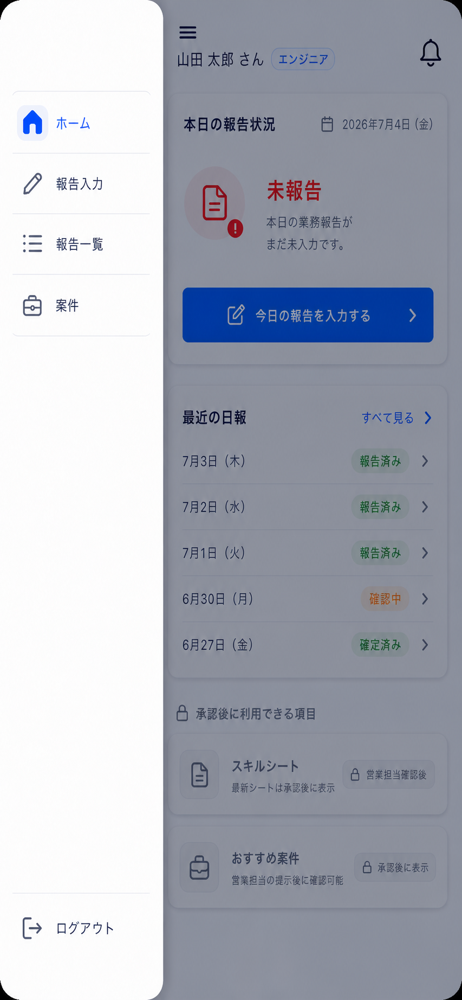

# 2. エンジニア用ホーム画面

| 項目             | 内容                                       |
| ---------------- | ------------------------------------------ |
| 対象ユーザー     | エンジニア                                 |
| 目的             | 自分の状況をひと目で確認し、次の行動へ入る |
| プラットフォーム | モバイルファースト                         |
| ルート           | `/`（エンジニアのトップ）                  |

## 目的・役割

ログイン後の起点。今日の報告状況・自分のスキルシート・対向システムから取得して自分向けに提示された案件を集約し、
「報告する」「確認する」への導線を最短化する。

## 画面構成

- ヘッダー（左上ハンバーガーメニュー、氏名・ロール表示、通知）
- ハンバーガーメニュー（ホーム、報告入力、報告一覧、案件、ログアウト）
- 今日の報告状況カード（報告済み／未報告のステータス、当日日付）
- クイックアクション（「今日の報告を入力する」ボタン）
- スキルシート閲覧カード（最新の自分のスキルシートへの導線）
- 推奨案件カード（対向システムから取得した本人向け案件の件数・概要）
- 最近の日報（直近数件へのショートカット、一覧(5)への導線）

## できること

- **今日の報告状況を確認する。** 当日の下書き有無・確定済みか未報告かをステータスで表示する。未報告なら入力(3)を促す。
- **業務報告入力へ進む。** 「今日の報告を入力する」から業務報告入力画面(3)へ遷移する。
- **自分のスキルシートを閲覧する。** 最新の生成済みスキルシートのプレビュー／ダウンロードへ導線を出す（未生成ならその旨を表示）。
- **推奨案件を確認する。** 対向システムから取得した本人向け案件があれば件数を示し、推奨案件画面(9)へ導線を出す。
- **過去の報告へ移動する。** 直近の報告と、業務報告一覧・詳細画面(5)への導線を出す。
- **メニューを開く。** 左上のハンバーガーメニューから主要導線とログアウトを表示する。マイページは設けない。

## 画面遷移

| 入口                 | 出口                                          |
| -------------------- | --------------------------------------------- |
| ログイン成功(1)      | 「報告を入力」→ 業務報告入力(3)               |
| 各画面のホームリンク | スキルシート閲覧 → （自分のスキルシート表示） |
|                      | 推奨案件 → エンジニア向け推奨案件(9)          |
|                      | 過去の報告 → 業務報告一覧・詳細(5)            |
| ハンバーガーメニュー | ホーム／報告入力／報告一覧／案件／ログアウト  |

## 権限・表示制御

- 表示されるデータはすべて本人のもののみ（自分の報告・自分のスキルシート・自分向けの案件）。バックエンドで本人IDに限定して取得する。
- ロールがエンジニアのユーザーのみ本画面をホームとする。営業担当は営業担当用ホーム(6)を起点とする。

## 関連データ

- `REPORTS`（当日の下書き／確定状況）
- `GENERATED_SHEETS`（自分の最新スキルシート）
- 対向システム取得案件（推奨案件フロー、(9)参照）

## 状態・エラーハンドリング

- 当日の下書きが未作成でも、入力画面(3)遷移時に idempotent に下書きを取得・作成する。
- スキルシート未生成・推奨案件なしの各カードは「なし」を明示し、空表示で不安を与えない。
- ヘッダーに「おはようございます」などの挨拶見出しは表示しない。

## デザイン例

### メニュー閉じた状態

### メニュー開いた状態

