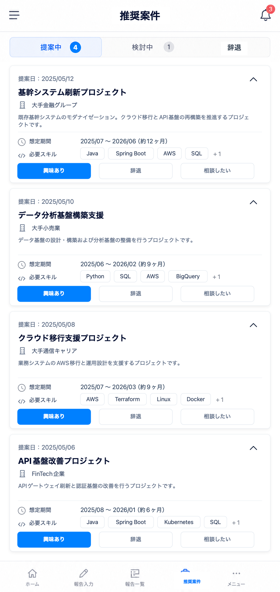

# 9. エンジニア向け推奨案件画面

| 項目             | 内容                                     |
| ---------------- | ---------------------------------------- |
| 対象ユーザー     | エンジニア                               |
| 目的             | 承認済みの推奨案件を確認し、意思表示する |
| プラットフォーム | モバイルファースト                       |
| ルート           | `/proposals`（想定）                     |

## 目的・役割

対向システムから取得した推奨案件をエンジニア本人に提示し、
「興味あり／辞退／相談したい」の意思表示を受け取る画面。
取得済みの本人向け案件を、本人の同意ベースで次のアクションにつなぐ。
推奨案件は対向システム由来で、本システム内のAIは生成・評価・順位付けに関与しない。
画面上に取得元説明文や推奨理由セクションは表示しない。
スキルマッチ度は表示しない。
回答期限は表示しない。
案件カード内のステータスチップ（提案中など）は表示せず、上部タブで状態を表す。

## 画面構成

- 状態タブ（提案中／検討中／辞退。履歴タブは表示しない）
- 推奨案件リスト（案件名・客先／概要・想定期間・必要スキル）
- 一覧は画面下部に大きな余白が出ないよう、表示可能な範囲で複数件の案件カードを縦に並べる
- 応答ボタン（興味あり／辞退／相談したい。提案中の全案件カードに表示）
- 応答済みステータス表示
- 詳細展開（案件の詳細説明）

## できること

- **承認済み案件を閲覧する。** 営業担当が承認した案件のみが表示される（未承認・却下は出ない）。
- **「興味あり」を送る。** 前向きな意思を営業担当へ通知する。
- **「辞退」を送る。** 見送る意思を伝える（理由は任意）。
- **「相談したい」を送る。** 判断前に営業担当と話したい旨を伝える。
- **応答状況を確認する。** 送信済みの応答と、その後の進捗ステータスを確認する。

## 推奨案件フローとの関係（重要）

- 表示対象は営業担当用ホーム(6)で「承認」された推奨案件のみ。承認前の候補は本画面に出ない。
- エンジニアの応答（興味あり／辞退／相談）は営業担当用ホーム(6)へ戻り、次の対応につながる。

## 画面遷移

| 入口                                  | 出口                                    |
| ------------------------------------- | --------------------------------------- |
| エンジニア用ホーム(2)の推奨案件カード | 応答送信 → 本画面に留まりステータス更新 |
| 新着通知                              | 応答内容が営業担当用ホーム(6)へ反映     |

## 権限・表示制御（重要）

- 表示は本人向けに承認された案件のみ。他人向けの案件は取得できない。バックエンドで強制。
- 応答できるのは本人のみ。

## 関連データ

- 対向システム取得案件・承認状態・提示先（推奨案件フロー）
- 応答ログ（興味あり／辞退／相談、応答日時）

## 状態・エラーハンドリング

- 推奨案件が0件の場合は「現在提示中の案件はありません」を明示する。
- 応答送信失敗時は再送できるようにし、二重応答を防ぐ。

## デザイン例

