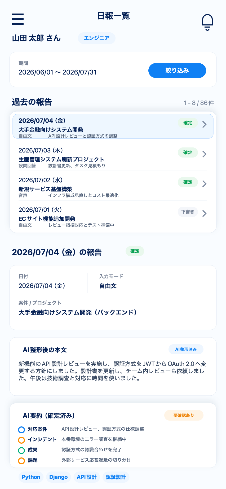

# 5. 業務日報一覧・詳細画面

| 項目             | 内容                                  |
| ---------------- | ------------------------------------- |
| 対象ユーザー     | エンジニア／営業担当                  |
| 目的             | 過去の報告を確認する                  |
| プラットフォーム | エンジニア：モバイル／営業担当：PC    |
| ルート           | 一覧 `/reports`、詳細 `/reports/[id]` |

## 目的・役割

確定済み（および下書き）の報告を時系列で振り返る画面。
エンジニアは自分の報告、営業担当は担当グループのエンジニアの報告を確認する。
確定済みの生報告ログは不変で、ここでは閲覧が主目的。

## 画面構成（一覧）

- 報告リスト（日付・名前・クライアント・入力モード・ステータス〈下書き／確定〉・対応案件・要約の冒頭）
- フィルタ／絞り込み（営業担当：エンジニア別・期間・客先・要確認残件）
- 各行から詳細(`/reports/[id]`)への導線

## 画面構成（詳細）

- 報告メタ情報（日付・ステータス・入力モード・対応案件）
- AI整形後本文（本文をAIで読みやすく整えた内容。メタ情報の直下に表示）
- 確定要約（カテゴリ別：対応案件／インシデント／成果／課題／抽出スキル）
- 元入力（raw_text）の参照
- 要確認フラグの表示
- 詳細右上の編集ボタン、右下のコピー／スキルシート管理へ／その他アクションは表示しない

## できること

- **報告を一覧する。** 過去の報告を時系列で並べ、ステータスや対応案件で概観する。
- **報告の詳細を見る。** AI整形後本文・確定要約・元入力を対照して確認する。
- **絞り込む（営業担当）。** 担当エンジニア・期間・客先・要確認残件で絞り込む。

## 雑感（メンタル面）の扱い（重要）

- 雑感は本画面の一般表示・営業担当の閲覧・AI変換から完全に除外する。
- 雑感の閲覧はHR／担当者と本人に限定する。スコア化・ダッシュボード化しない。

## 画面遷移

| 入口                  | 出口                                  |
| --------------------- | ------------------------------------- |
| エンジニア用ホーム(2) | 行クリック → 報告詳細 `/reports/[id]` |
| 営業担当用ホーム(6)   | 行クリック → 報告詳細 `/reports/[id]` |
| ナビ「過去の報告」    |                                       |

## 権限・表示制御（重要）

- **エンジニア：** 自分の報告のみ。他人の報告は取得できない。
- **営業担当：** 担当グループのエンジニアの報告のみ。担当外グループは閲覧不可。
- 認可はバックエンドで強制する（URL直打ちで他人の `/reports/[id]` を開いても拒否）。

## 関連データ

- `REPORTS`（確定要約・元入力・ステータス）
- `REPORT_PROJECTS` / `PROJECTS`（対応案件の表示）
- `INCIDENTS`（インシデント状態）

## 状態・エラーハンドリング

- 存在しない／権限のない報告IDは404相当で拒否する。
- 下書きと確定を明確に区別して表示する。

## デザイン例

