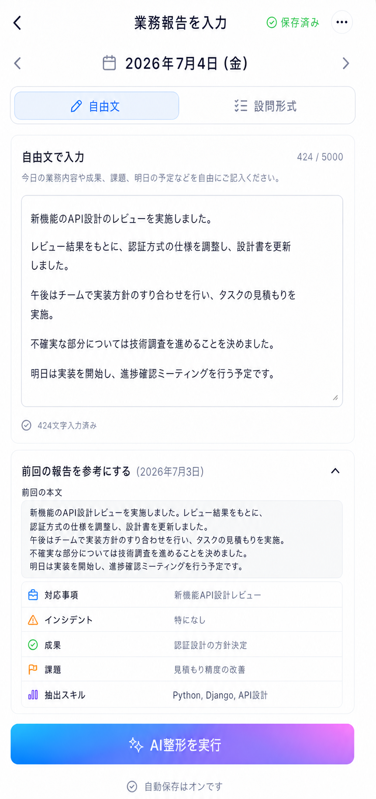
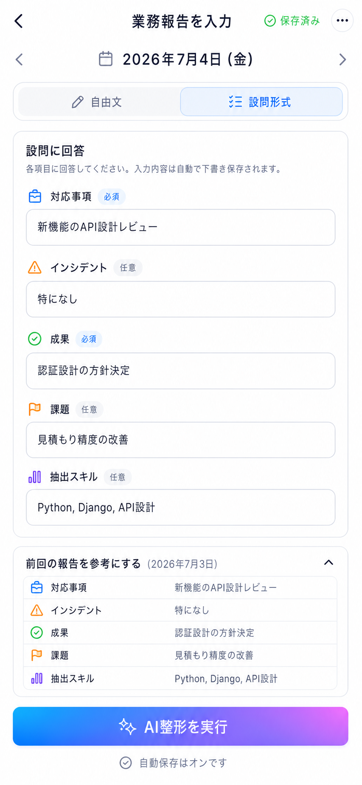

# 3. 業務報告入力画面

| 項目             | 内容                 |
| ---------------- | -------------------- |
| 対象ユーザー     | エンジニア           |
| 目的             | 日報・週報を入力する |
| プラットフォーム | モバイルファースト   |
| ルート           | `/report`            |

## 目的・役割

その日の業務内容を入力する起点画面。自由記述・設問回答で入力し、
AI整形を実行して整形結果確認画面(4)へ渡す。入力負担を下げるため前回の本文・カテゴリ別内容を参照表示する。

## 画面構成

- 当日日付・入力モード切替（自由文／設問回答）
- 本文入力エリア（自由文モード：大きめのテキストエリア）
- 設問回答フォーム（設問回答モード：グループ別の設問セットに沿った入力欄）
- 前回参照（折り畳み）：前回の本文と前回確定済みのカテゴリ別内容を読み取り専用で展開
- 自動保存インジケータ（保存中／保存済み／確定済み）
- 「AI整形を実行」ボタン

## できること

- **自由記述で入力する。** 雑に投げてもAIが整形するため、きれいな言葉で入力する必要がなく、入力ハードルが下がる。
- **設問回答で入力する。** グループごとに管理者が定義した設問セットに沿って回答することでAIがそれを解釈し、整形してくれる。設問には回答形式（短文／長文／選択）と必須／任意がある。
- **常時自動保存される。** 入力は自動で下書保存され、画面を閉じても復元可能。当日の下書きは初回ロード時に idempotent に取得・作成する。
- **前回の内容を参照する。** 前回の本文と、対応事項・インシデント・成果・課題・抽出スキルなどの前回確定済み内容を折り畳みで読み取り専用表示し、起案コストを下げる（丸写しを誘発しない控えめな表示）。
- **AI整形を実行する。** 「AI整形を実行」を押すと、保留中の自動保存を即時フラッシュしてから要約APIを呼び、構造化結果を作ってAI整形結果確認画面(4)へ進む。

## 入力モードと役割

| モード   | 内容                                                                     | フェーズ  |
| -------- | ------------------------------------------------------------------------ | --------- |
| 自由文   | 大きめのテキストエリアに自由記述。                                       | Phase 1   |
| 設問回答 | グループ別設問セットに沿った回答。役割タグで突合・シート反映先が決まる。 | Phase 1〜 |

## 画面遷移

| 入口                                | 出口                                |
| ----------------------------------- | ----------------------------------- |
| エンジニア用ホーム(2)「報告を入力」 | 「AI整形を実行」→ AI整形結果確認(4) |
| ナビの「入力」                      | 下書き保存のまま離脱 → 後で再開可能 |

## 権限・データ

- 入力・保存できるのは本人の当日報告のみ。バックエンドで user_id を強制する。
- `REPORTS`（id, user_id, report_date, input_mode, raw_text）を下書きとして保存。確定は(4)で行う。
- 設問セットは `QUESTION_SETS`（グループ別・バージョン付き）を参照。報告は作成時のテンプレート版を保持する。

## AIの原則（重要）

- AI要約は提供元非依存の抽象化層の背後で呼ぶ（Claude／Gemini／Vertexを差し替え可能）。

## 状態・エラーハンドリング

- 自動保存はデバウンス。要約押下時は保留タイマーを即時フラッシュしてから要約を呼ぶ。
- ページ遷移・アンマウント後に古いAPIレスポンスがstateを汚染しないよう、reportId等でガードする。
- 通信断・AI整形失敗時も入力内容を失わず、下書きから再開できる。

## デザイン例

### 自由文タブ

### 設問回答タブ

