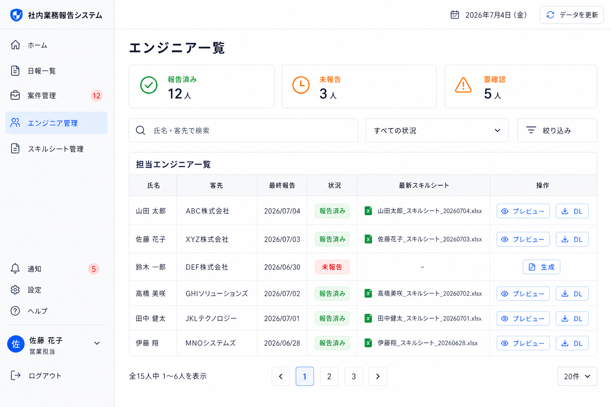

# 7. エンジニア一覧画面

| 項目             | 内容                                                       |
| ---------------- | ---------------------------------------------------------- |
| 対象ユーザー     | 営業担当                                                   |
| 目的             | 担当エンジニアの報告状況と最新スキルシートを一覧で確認する |
| プラットフォーム | PC前提（一覧性重視）                                       |
| ルート           | `/engineers`（想定）                                       |

## 目的・役割

営業担当が担当グループのエンジニアを横断して確認する一覧画面。
氏名・客先・最終報告・状況・最新スキルシート・操作を1画面に集約し、未報告者や要確認者、最新スキルシートの有無を素早く把握できるようにする。

## 画面構成

- 画面タイトル「エンジニア一覧」
- タイトル下の補足テキストは表示しない
- 報告状況サマリー（報告済み／未報告／要確認）
- 氏名・客先検索
- 状況フィルター
- 担当エンジニア一覧
  - 氏名
  - 客先
  - 最終報告
  - 状況（報告済み／未報告）
  - 最新スキルシート
  - 操作（プレビュー／DL／生成）

## できること

- **担当エンジニアを一覧で確認する。** 担当グループに属するエンジニアのみを表示する。
- **報告状況を把握する。** 最終報告日と報告済み／未報告ステータスを確認する。
- **最新スキルシートを確認する。** 生成済みの場合はファイル名を表示し、未生成の場合は「‐」を表示する。
- **スキルシートを操作する。** 生成済みの場合は最新スキルシートのプレビュー、ダウンロードを行う。
- **未生成時の操作を制御する。** 未生成の場合は「生成」ボタンを表示し、対象ユーザーのスキルシート管理・生成確認(8)へ遷移する。

## 画面遷移

| 入口                                  | 出口                                                        |
| ------------------------------------- | ----------------------------------------------------------- |
| 営業担当用ホーム(6)「エンジニア管理」 | エンジニア管理画面                                          |
| エンジニア管理「プレビュー」          | 最新スキルシートのプレビュー                                |
| エンジニア管理「DL」                  | 最新スキルシートのダウンロード                              |
| エンジニア管理「生成」                | スキルシート管理・生成確認(8)（対象ユーザーで絞り込み済み） |

## 権限・表示制御（重要）

- 表示対象は担当グループのエンジニアのみ。担当外グループのデータは表示・取得しない。
- 認可はバックエンドで強制する。
- 雑感（メンタル面）は本画面に表示しない。

## 関連データ

- `USERS`（担当グループのエンジニア）
- `REPORTS`（最終報告・報告済み／未報告ステータス）
- `GENERATED_SHEETS`（最新スキルシート）

## 状態・エラーハンドリング

- 未報告のエンジニアは赤系のステータスで明示する。
- 要確認の残件がある場合は警告ステータスとして表示する。
- スキルシート未生成のエンジニアは最新スキルシート欄に「‐」を表示し、操作欄には「生成」ボタンのみを中央揃えで表示する。

## デザイン例

