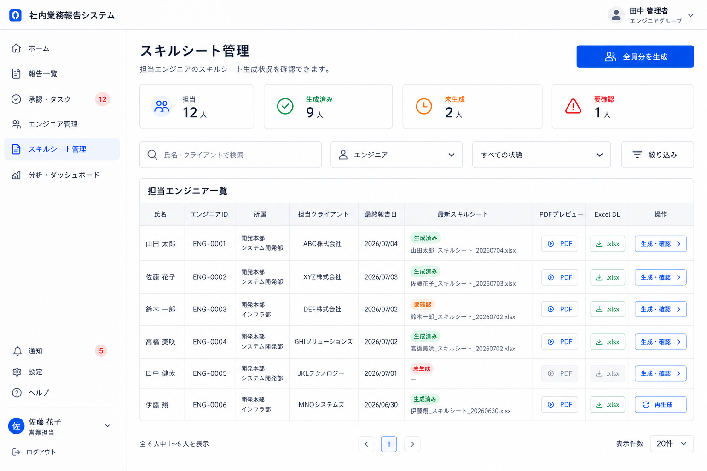
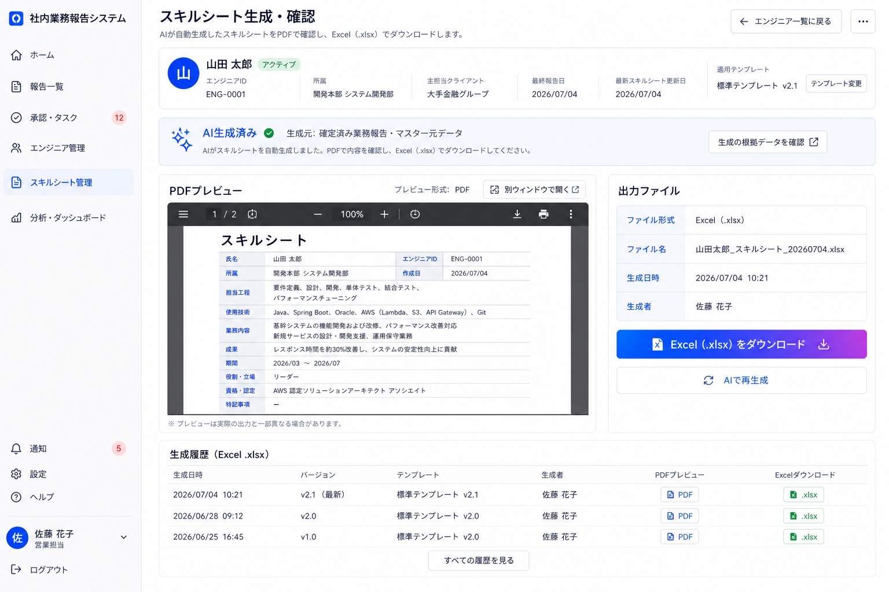

# 8. スキルシート管理・生成確認画面

| 項目             | 内容                                                                                     |
| ---------------- | ---------------------------------------------------------------------------------------- |
| 対象ユーザー     | 営業担当                                                                                 |
| 目的             | 担当エンジニア全員のスキルシート生成状況を確認し、個別にPDF確認・Excelダウンロードを行う |
| プラットフォーム | PC前提                                                                                   |
| ルート           | `/skillsheets`、`/skillsheets/[engineerId]`（想定）                                      |

## 目的・役割

営業担当が担当しているエンジニア全員のスキルシート生成状況を一覧で確認し、対象エンジニアを押下して個別の生成・確認画面へ進む。
個別画面では、AIが自動生成したスキルシート（Excel）をPDFプレビューで確認し、Excel形式でダウンロードする。
生成は「データ組み立て → AI変換（言い換えのみ）→ テンプレート反映」の3フェーズで決定的に行う。
確定するたびに新ファイルを作り、反映履歴として残す。
ダウンロード後に必要な手動調整はExcel上で行うため、本画面には編集フォームを置かない。

## 画面構成

### スキルシート管理一覧

- 担当エンジニア全員の一覧
- 生成状況（生成済み／未生成／要確認）
- 最新スキルシートのファイル名・生成日
- PDFプレビュー、Excel（.xlsx）ダウンロード
- 個別の「生成・確認」導線
- 全員分の一括生成導線

### 個別生成・確認

- 対象エンジニア情報・使用テンプレート（グループ別・有効版）
- AI生成済みステータス・生成元データ
- PDFプレビュー（xlsxをプレビュー用PDFへ変換して表示）
- 出力ファイル情報（ファイル形式、ファイル名、生成日時、生成者）
- 反映履歴（過去に生成したスキルシートの一覧・世代）
- 「Excel（.xlsx）をダウンロード」ボタン／「AIで再生成」導線

## できること

- **担当者全員を確認する。** 営業担当が担当するエンジニア全員のスキルシート生成状況を一覧で確認する。
- **個別画面へ進む。** 一覧の行または「生成・確認」から、対象エンジニアの生成・確認画面へ進む。
- **AIで自動生成する。** 確定済み業務報告・マスター元データからスキルシート案を自動生成する。
- **PDFプレビューを確認する。** 生成されたスキルシートをPDFで確認する（ダウンロードは元のxlsx）。
- **Excelをダウンロードする。** 生成済みxlsxを署名付きURLでダウンロードする。必要な手動修正はダウンロード後にExcel上で行う。
- **再生成する。** マスター元データやテンプレートをもとに、スキルシートを再生成できる。
- **ファイル名を自動付与する。** 「[スタッフ名]_[ファイル名]_YYYYMMDD.xlsx」をサーバ側で機械的に付与する（日付は出力日）。
- **反映履歴を確認する。** 再生成のたびに新ファイルが履歴として残り、過去世代を辿れる。

## 生成の3フェーズ（重要）

| フェーズ         | 内容                                                                                                                             |
| ---------------- | -------------------------------------------------------------------------------------------------------------------------------- |
| データ組み立て   | マスター元データ・案件・スキル集計をDBから決定的に取得する。                                                                     |
| AI変換           | 事実を職務経歴書向けの専門用語・客観的成果へ言い換える。マスターに無い数値は創作しない。出力はアンカー対応のJSONスキーマに固定。 |
| テンプレート反映 | openpyxlでアンカー位置へ書き込む。案件ブロックは雛形行を複製し、書式（罫線・結合・フォント）を維持する。                         |

## Excel生成の原則（重要）

- アンカー方式 + openpyxl。テンプレートのプレースホルダ／名前付き範囲に書き込む。
- 繰り返しブロックは雛形行を複製して書式を維持する。データ取得と書き込みは決定的に。
- 生成物はオブジェクトストレージに格納し、DBにメタデータと署名付きURLを保持する。

## 画面遷移

| 入口                                               | 出口                 |
| -------------------------------------------------- | -------------------- |
| 営業担当用ホーム(6)「スキルシート管理」            | スキルシート管理一覧 |
| スキルシート管理一覧のエンジニア行／「生成・確認」 | 個別生成・確認       |
| 個別生成・確認「エンジニア一覧に戻る」             | スキルシート管理一覧 |
| 個別生成・確認「Excel（.xlsx）をダウンロード」     | Excelダウンロード    |

## 権限・表示制御（重要）

- 対象は担当グループのエンジニアのみ。担当外は不可。バックエンドで強制。
- 雑感は反映しない。「課題」「所感」は原則非反映。
- グループ別テンプレートは設定駆動で切り替える（コード分岐を増やさない）。

## 関連データ

- `TEMPLATES`（グループ別Excelテンプレート・アンカーマップ・有効版）
- `MASTER_SUMMARIES` / `PROJECTS` / `SKILLS`（書き込む値の源）
- `GENERATED_SHEETS`（生成履歴・ファイル名・署名付きURL）

## 状態・エラーハンドリング

- アンカー不整合・テンプレート不備は生成前に検証し、警告する。
- 数値未記載箇所は空欄のまま出力する（創作しない）。
- 生成失敗時は履歴を汚さず、再試行できるようにする。

## デザイン例

### スキルシート管理一覧

### 個別生成・確認（生成前）

### 個別生成・確認（生成後）

