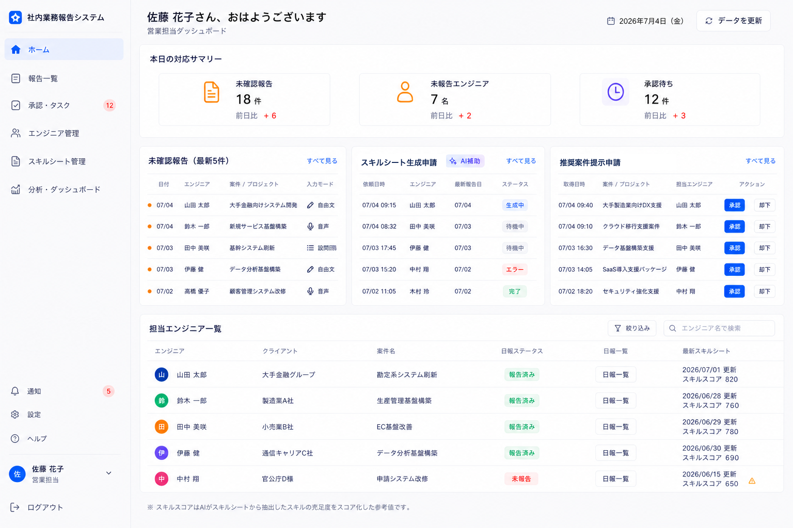

# 6. 営業担当用ホーム画面

| 項目             | 内容                                       |
| ---------------- | ------------------------------------------ |
| 対象ユーザー     | 営業担当                                   |
| 目的             | 担当エンジニアの状況と対応タスクを確認する |
| プラットフォーム | PC前提（一覧性重視）                       |
| ルート           | `/`（営業担当のトップ）                    |

## 目的・役割

営業担当のダッシュボード。担当グループのエンジニアの報告状況、未確認の対応、
スキルシート生成申請、推奨案件提示申請を1画面に集約し、対応タスクを捌く起点にする。

## 画面構成

- 今日の対応サマリー（未確認報告件数・未報告エンジニア数・承認待ち件数）
- 未確認報告リスト（新着の確定報告、詳細(5)への導線）
- スキルシート生成申請一覧（エンジニアからの生成申請、スキルシート管理・生成確認(8)への導線）
- 推奨案件提示申請（対向システムから取得した推奨案件の提示申請、承認/却下）
- 担当エンジニア一覧（氏名・クライアント・案件名・日報ステータス〈報告済み／未報告〉・日報一覧・最新スキルシート）

## できること

- **今日の対応サマリーを把握する。** 未確認報告・未報告者・承認待ちの件数をひと目で確認する。
- **未確認報告を確認する。** 担当エンジニアの新着報告を業務報告一覧・詳細(5)で確認する。
- **スキルシート生成申請を捌く。** エンジニア／報告起点の生成申請から、スキルシート管理・生成確認(8)へ進む。
- **推奨案件提示申請を承認する。** 対向システムから取得した推奨案件の提示申請を承認すると、対象エンジニアの案件提示画面(9)に表示される。却下も可能。
- **担当エンジニアを俯瞰する。** 一覧でクライアント・案件名・日報ステータス・日報一覧導線・最新スキルシートを確認する。
- **エンジニア別の日報一覧を開く。** 「日報一覧」を押下すると、業務報告一覧・詳細(5)を対象エンジニア名でフィルターした状態で表示する。
- **未報告者を把握する。** 「未報告」ステータスと連動し、リマインドが必要な相手を可視化する。

## 案件提示フローとの関係

- ここで営業担当が承認した対向システム取得案件のみが、エンジニア向け案件提示画面(9)に出る。
- エンジニアの応答（興味あり／辞退／相談したい）は本ホームの承認待ち／対応リストへ戻る。

## 画面遷移

| 入口                        | 出口                                                                 |
| --------------------------- | -------------------------------------------------------------------- |
| ログイン成功(1)（営業担当） | 未確認報告 → 業務報告一覧・詳細(5)                                   |
|                             | 生成申請 → スキルシート管理・生成確認(8)                             |
|                             | 推奨案件提示申請 → 承認/却下（案件提示(9)へ反映）                    |
|                             | 日報一覧 → 業務報告一覧・詳細(5)（対象エンジニア名でフィルター済み） |

## 権限・表示制御（重要）

- 表示は担当グループのエンジニアのみ。担当外グループのデータは一切表示・取得しない。
- タブはグループに対応し、担当管理者には自分の担当グループのみ表示する。
- 認可はバックエンドで強制する。
- 雑感（メンタル面）は本画面に表示しない（HR／担当者と本人のみ）。

## 関連データ

- `USERS`（担当グループのエンジニア）
- `REPORTS`（最終報告・未確認・未報告ステータス）
- `GENERATED_SHEETS`（最新スキルシート）
- 対向システム取得案件・承認状態（案件提示フロー）

## 状態・エラーハンドリング

- スキルシート未生成のエンジニアはその旨を明示する。
- 要確認の残件（確定済みだが数値未記載等）をフラグ表示する。

## デザイン例

